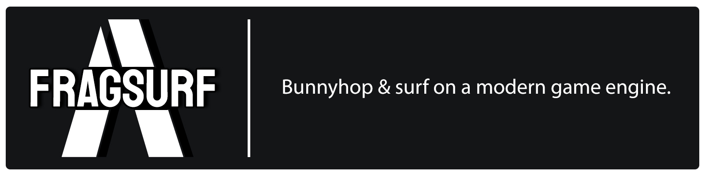
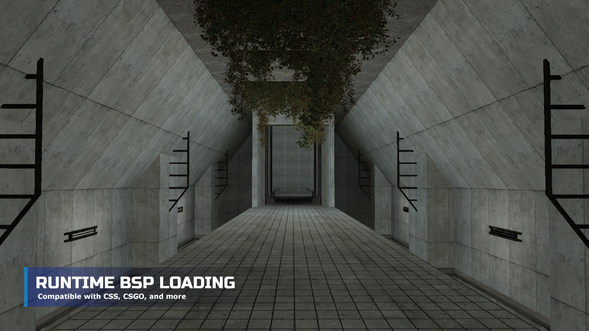
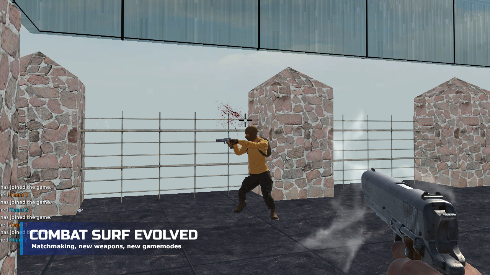
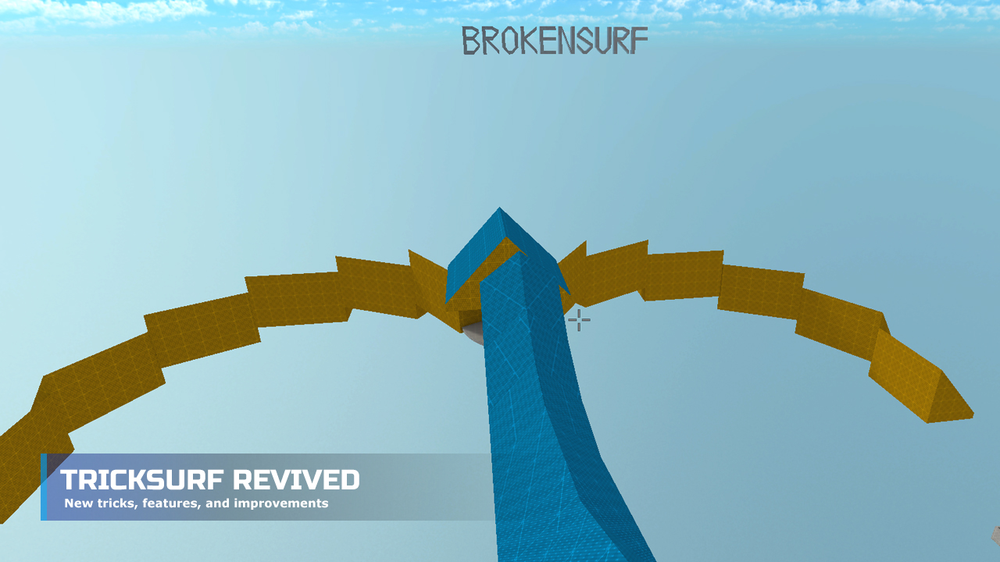
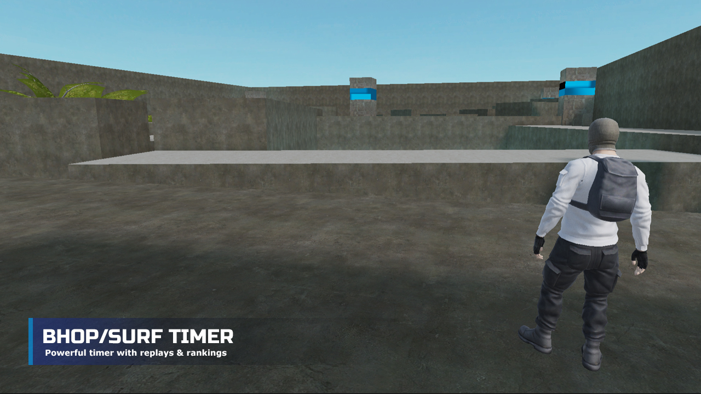
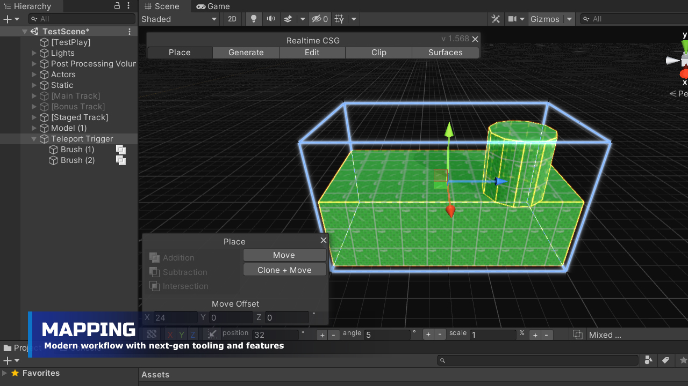

## Links

[Website](https://fragsurf.com)

[Steam](https://store.steampowered.com/app/1033410/Fragsurf/)

[Discord](https://discord.com/invite/P9YPvCa)

[Patreon](https://www.patreon.com/Fragsurf)

[Wiki](https://wiki.fragsurf.com)

[Forum](https://forum.fragsurf.com)

[Default Material Pack](https://github.com/cr4yz/Fragsurf-Default-Materials)

The project contains a scene named TestScene with various triggers and meshes, it uses materials from the material pack linked above.  To add it, download or clone the material pack into a folder under your Unity project's Assets folder, i.e. Assets/Default-Material-Pack.
