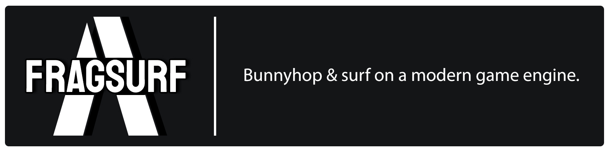

The full source code for Fragsurf.

https://store.steampowered.com/app/1033410/Fragsurf/

Feel free to clone it, play with it, and create issues and pull requests.  Steam is not required to play Fragsurf, but because it relies on Steam for P2P and other multiplayer features some systems will not work properly without it.

The code is going public because in order for the modding toolkit to be as powerful and flexible as possible for creators, it contains the source code.  Due to this, it only makes sense to create an official public source repository for Fragsurf.

## Links

[Website](https://fragsurf.com)

[Steam](https://store.steampowered.com/app/1033410/Fragsurf/)

[Discord](https://discord.com/invite/P9YPvCa)

[Wiki](https://wiki.fragsurf.com)

[Forum](https://forum.fragsurf.com)
