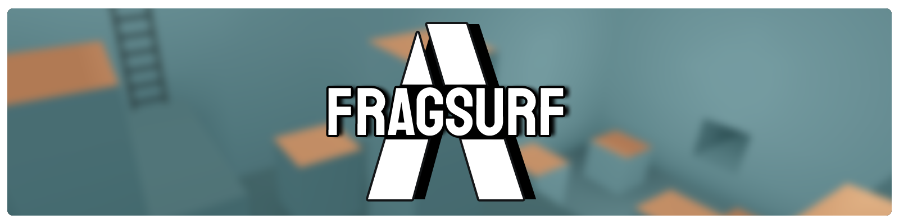

Fragsurf is an actively developed next-gen surf and bunnyhop game developed with philosophy that favors modding.  This repository contains the majority of Fragsurf's source code which can be used for reference, education, experimenting, and modding.  Not included in this repository are assets that we do not have a license to release to the public, but will be included in game builds provided on Steam.  Excluded assets are mostly 3d weapons and viewmodel animations.

If you download and build Fragsurf without owning it on Steam you may experience some limited functionality, notably in multiplayer.

You are welcome to contribute to Fragsurf's development in any way you like!  

## Screenshots

## Links

[Website](https://fragsurf.com)

[Steam](https://store.steampowered.com/app/1033410/Fragsurf/)

[Discord](https://discord.com/invite/P9YPvCa)

[Patreon](https://www.patreon.com/Fragsurf)

[Wiki](https://wiki.fragsurf.com)

[Forum](https://forum.fragsurf.com)

[Default Material Pack](https://github.com/cr4yz/Fragsurf-Default-Materials)

The project contains a scene named TestScene with various triggers and meshes, it uses materials from the material pack linked above.  To add it, download or clone the material pack into a folder under your Unity project's Assets folder, i.e. Assets/Default-Material-Pack.
